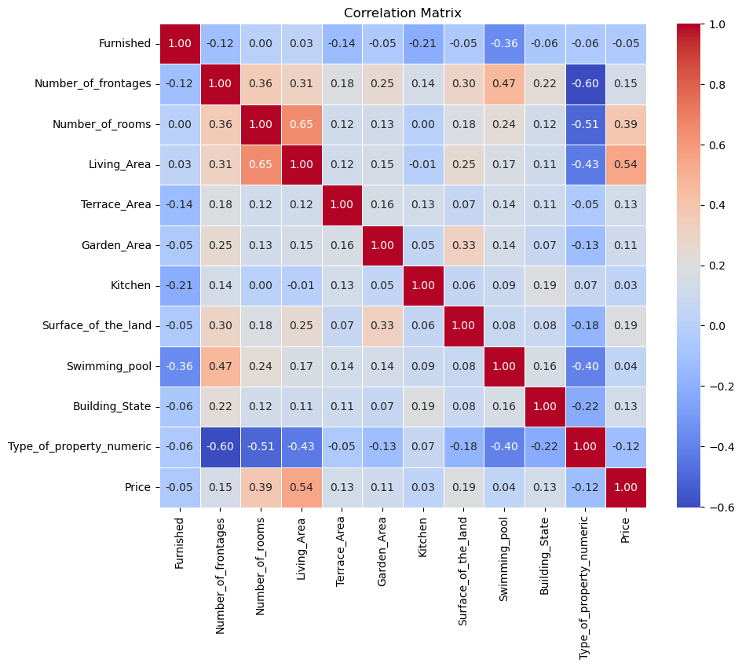

# Price Prediction of Belgium's Real Estate Market using Machine Learning Algorithms

## Table of Contents

- [Introduction](#1-introduction)

- [Methodology](#2-methodology)

- [Data Preparation](#21-data-preparation)

- [Exploratory Data Analysis](#22-exploratory-data-analysis)

- [Model Implementation](#3-model-implementation)

- [Results](#4-results)

- [Recommendations](#5-recommendations)

## 1. Introduction

The real estate market in Belgium, like many others, is influenced by a variety of factors such as location, property type, size, and condition. Accurate price prediction is crucial for both buyers and sellers, and machine learning algorithms offer a promising approach to forecasting property prices based on these features. In this study, the aim was to develop a predictive model for the Belgian real estate market using a dataset gathered from the Immoweb website, which contains 12,267 property listings with 26 attributes. These attributes span both categorical data, such as property type and location, and numerical data, including price, living area, and the number of rooms.

The dataset underwent a thorough preprocessing stage to ensure its suitability for model development. This included filtering out irrelevant or incomplete data, encoding categorical variables numerically, and creating new features to better capture the relationships between the attributes and the target variable, price. Features like "Room_Space_Combined," which combines living area and the number of rooms, and "Outside_area," which sums terrace and garden areas, were engineered to provide more comprehensive insights into property value. Additionally, geographical information, such as distances to major cities, was incorporated to assess accessibility, an important factor in real estate prices. The resulting dataset, cleaned and transformed, served as the foundation for applying machine learning algorithms to predict property prices.

This paper explores the process of data preparation, exploratory data analysis, and model implementation with the goal of improving the accuracy of real estate price predictions in Belgium. It aims to provide valuable insights into the factors influencing property prices and offer recommendations for further model improvements.

## 2. Methodology

Figure 1 depicts the framework of the project.

### 2.1 Data Preparation

The dataset used is taken from Immoweb website. The acquired dataset consists of 12,267 properties in Belgium with twenty six attributes. There are eight categorical attributes which are Kitchen, Type_of_sale, Subtype_of_property, Building_State, Type_of_property, Locality, Region, Province.  While there are another eighteen numerical attributes namely Price, Number_of_rooms, Living_Area, Number_of_frontages, Surface_of_the_land,Garden_Area,Terrace_Area,Postal_Code.

In data pre-processing, the dataset undergoes the cleansing process filtering meaningless data to have consistent datasets. Up to 137 records are removed due to different values between property subtypes and missing postal codes. Categorical data types were encoded as numbers, unusual features were removed, and the data type was changed to ensure the dataset was complete for model development.

The preprocessing code engineer’s specific features and applies transformations to clean and encode data, aiming to improve its utility for modeling while minimizing noise or irrelevant details. It creates Room_Space_Combined as a metric to represent the proportional living space by multiplying Living_Area and Number_of_rooms, emphasizing both area and room count in a single feature. Similarly, Outside_area combines Terrace_Area, Garden_Area, and Surface_of_the_land to provide a holistic measure of external space, relevant for assessing property value.

Region_Numeric translates regions into numeric values (Brussels-Capital Region = 1, Flanders = 2, Wallonia = 3) to facilitate inclusion in mathematical models, while Subtype_category initially encoded property subtypes based on ranked average prices, but this was refined to encode based on occurrence counts for balance. Additionally, features like Dist_Hasselt calculate Haversine distances to major cities using geographical coordinates, quantifying accessibility—a key real-estate metric.

To clean and refine the dataset, features like Postal_Code were preserved for geographical insights, while Kitchen and Building_State were encoded to numerically reflect qualitative states (e.g., missing, installed, or needing renovation). Other features like Number_of_frontages and potentially Province_numeric were directly or indirectly numericized to support modeling needs. These steps collectively ensure feature relevance and reduce the risk of data leakage while balancing representativeness across categories.

### 2.2 Exploratory Data Analysis

Exploratory data analysis and Pearson correlation  analysis have been conducted to get a preliminary understanding of the clean dataset before applying machine learning algorithms.

2.2.1 *Correlation Analysis*
  
Correlation analysis determines the strength of a relationship between two attributes. In the study, **Price** undergoes correlation analysis with all the other attributes to identify the strength of the linear relationship between the other attributes with **Price**. **Price** has the strongest correlation with **Living_Area**, with a value of r = 0.544, indicating a moderate positive relationship. A moderate correlation is also observed with **Number_of_rooms**, which has a value of r = 0.386.

Attributes such as **Surface_of_the_land**, **Number_of_frontages**, **Terrace_Area**, **Building_State**, and **Garden_Area** show weak positive correlations with **Price**, with values of r = 0.189, 0.147, 0.133, 0.132, and 0.112, respectively.

**Swimming_pool** and **Kitchen** show very low positive correlations with **Price**, with r = 0.040 and r = 0.035. On the other hand, **Furnished**, **Type_of_property_numeric**, and exhibit weak negative correlations with **Price**, having r = -0.046, -0.122,  respectively.

The findings indicate that attributes like **Living_Area** and **Number_of_rooms** are more strongly associated with **Price**, while attributes like **Type_of_property_numeric** and **Furnished** show weaker, negative relationships.
Figure 2 below illustrates the heatmap of Pearson correlation coefficients between various property attributes and the listing price.

## 3. Model Implementation

The accuracy of the model is computed through a series of carefully chosen steps to ensure robust evaluation. First, the data is split into training and testing sets using an 80/20 split, a standard practice that balances the need for model training and evaluation. Additionally, during training, a 3-fold cross-validation is implemented in the RandomizedSearchCV process, allowing the model to be validated across multiple splits of the training data for better generalization.

To evaluate performance, multiple metrics are calculated on both the training and testing sets. These include Root Mean Squared Error (RMSE) for assessing error magnitude, R² to determine the explained variance, Mean Absolute Error (MAE) for average error measurement, and Mean Absolute Percentage Error (MAPE) and Symmetric Mean Absolute Percentage Error (sMAPE) to provide percentage-based accuracy insights. RMSE is particularly sensitive to large errors, while sMAPE addresses MAPE's imbalance between over- and under-predictions.

The target variable (Price) undergoes a log transformation during preprocessing to stabilize variance and reduce skewness in the dataset. Predictions are then transformed back to their original scale for accurate evaluation. Together, these steps ensure a comprehensive and balanced evaluation of the model’s predictive performance.

## 4. Results

The model's results suggest a moderately performing model with room for improvement. The RMSE (Root Mean Squared Error) of 88,195.99 indicates that the average magnitude of the prediction errors is substantial, which could have a significant impact depending on the scale of property prices in the dataset. This suggests that the model’s predictions deviate considerably from the actual values. The R² value of 0.6046 indicates that 60.46% of the variance in property prices is explained by the model, leaving a considerable portion of the variance unexplained. This implies that the model has potential for improvement to enhance its predictive power.

The MAE (Mean Absolute Error) of 64,005.06 further confirms that the average prediction error remains high. While MAE is less sensitive to large errors compared to RMSE, this still indicates that the model could benefit from enhancements. The MAPE (Mean Absolute Percentage Error) of 20.77% suggests that, on average, the model’s predictions are off by approximately 20.77%. This is a moderate level of error and could be reduced with improved feature engineering or model tuning. The sMAPE (Symmetric Mean Absolute Percentage Error) of 4.91% is much lower than MAPE, indicating that the model performs better in balancing over- and under-predictions.

## 5. Recommendations

To improve the model, several areas need attention. Enhancing feature engineering is one key aspect. Introducing new features that capture additional factors of property prices, such as proximity to amenities or economic indicators, could be beneficial. Investigating interactions between features or creating polynomial features may uncover more complex relationships that the model is currently missing.

Improving data quality and diversity is another crucial area. Ensuring that the dataset is representative of the target market, with sufficient samples for each property type, can help prevent the model from struggling with underrepresented categories. Addressing class imbalances in the data could be valuable. Moreover, examining and removing outliers may help reduce unnecessary noise, which can negatively impact predictions.
